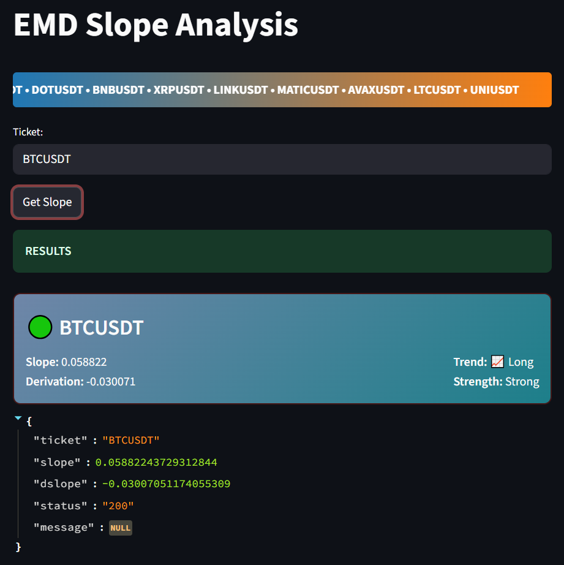

# Emperical Mode Decomposition (EMD) for stock data analyze

## **About**
## <p>This method based on decomposing signal (natural analog signals or artificial stock pricing in that case) into **Intrinsic Mode Functions** (IMF)</p>
---

---

---
## **Quick Start**
1. Clone the repo

    ```git clone https://github.com/Andy666Fox/emd_traiding.git```


2. Check and install requiered dependencies 

    ```uv/pip install -r requirements.txt```

3. There may be problems installing the *price_loaders* package which is responsible for getting data from tradingview. In this case, you can drag it from here https://github.com/batprem/price-loaders
4. Entry point is *get_data_slope()* function with ticket argument

    ```get_data_slope("BTCUSDT")```
---
## Docker
### It's possible to run it in Docker. I spent a lot of time unifying the configurations, so just run 

### `docker compose up -d --build`

### The UI will be available at `localhost:80`, the address for the API is `localhost:80/api`

### If that doesn't work, the source code includes nginx configs and the configuration for each service. There's nothing particularly buggy there, so I'm almost certain everything will run without a hitch.
---
## Features
1. Easy data loading
2. Ability to customize IMF level
3. A negative slope value indicates a downward price movement, and the opposite is also true.
---
### EMD on [wiki](https://ru.wikipedia.org/wiki/Empirical_Mode_Decomposition)
### EMD python [library](https://pyemd.readthedocs.io/en/latest/emd.html) 