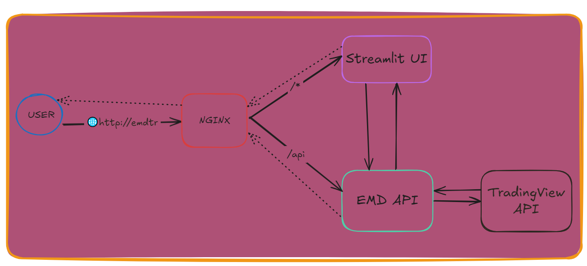
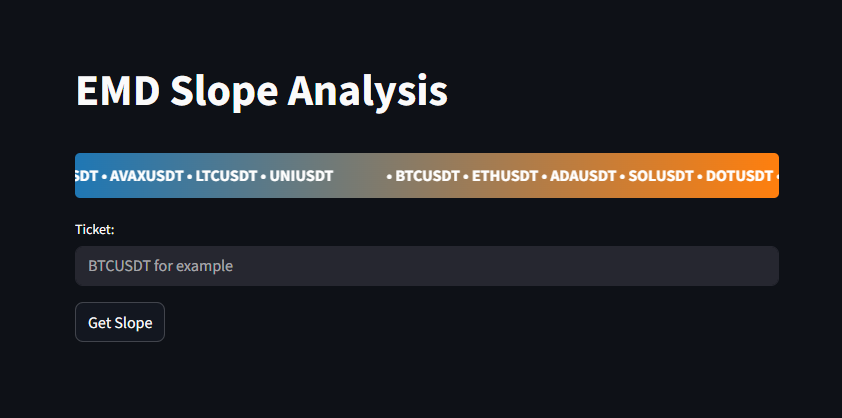

# Emperical Mode Decomposition (EMD) for stock data analyze

## **About**
## <p>This method based on decomposing signal (natural analog signals or artificial stock pricing in that case) into **Intrinsic Mode Functions** (IMF)</p>
---

---
## **Quick Start**
1. Clone the repo

    ```git clone https://github.com/Andy666Fox/emd_traiding.git```


2. Check and install requiered dependencies 

    ```uv/pip install -r requirements.txt```

3. There may be problems installing the *price_loaders* package which is responsible for getting data from tradingview. In this case, you can drag it from here https://github.com/batprem/price-loaders
4. Entry point is *get_data_slope()* function with ticket argument

    ```get_data_slope("BTCUSDT")```

---
## Features
1. Easy data loading
2. Ability to customize IMF level
3. A negative slope value indicates a downward price movement, and the opposite is also true.
4. Now you can raise a simple fastapi application for convenient api requests if you want to use the functionality in your services.

    ```python api_main.py```

5. For personal use you can raise *streamlit web interface*

    ```streamlit run ui/ui_main.py```
    


### EMD on [wiki](https://ru.wikipedia.org/wiki/Empirical_Mode_Decomposition)
### EMD python [library](https://pyemd.readthedocs.io/en/latest/emd.html) 